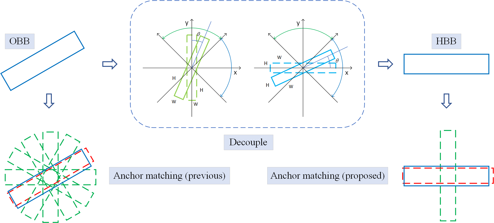
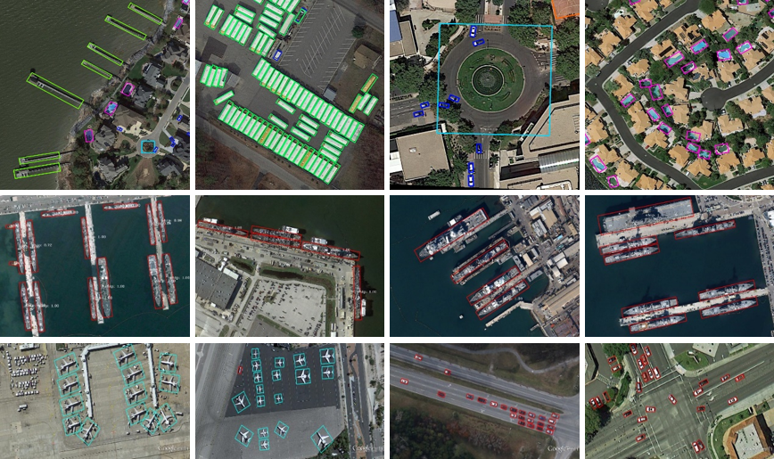

# Single-Stage Rotation-Decoupled Detector for Oriented Object

This is the repository of paper **Single-Stage Rotation-Decoupled Detector for Oriented Object**. [[Paper]](https://www.mdpi.com/2072-4292/12/19/3262/htm) [[PDF]](https://www.mdpi.com/2072-4292/12/19/3262/pdf)

**Update:**  Updated the code for training on the DOTA, HRSC2016 and UCAS-AOD datasets. Uploaded the weights trained on these datasets.




## Introduction

We optimized the anchor-based oriented object detection method by decoupling the matching of the oriented bounding box and the oriented anchor into the matching of the horizontal bounding box and the horizontal anchor.

## Performance

### DOTA1.0 (Task1)

Reported in our paper:

| backbone  | MS   | mAP   | PL    | BD    | BR    | GTF   | SV    | LV    | SH    | TC    | BC    | ST    | SBF   | RA    | HA    | SP    | HC    |
| --------- | ---- | ----- | ----- | ----- | ----- | ----- | ----- | ----- | ----- | ----- | ----- | ----- | ----- | ----- | ----- | ----- | ----- |
| ResNet101 | ×    | 75.52 | 89.7  | 84.33 | 46.35 | 68.62 | 73.89 | 73.19 | 86.92 | 90.41 | 86.46 | 84.3  | 64.22 | 64.95 | 73.55 | 72.59 | 73.31 |
| ResNet101 | √    | 77.75 | 89.15 | 83.92 | 52.51 | 73.06 | 77.81 | 79    | 87.08 | 90.62 | 86.72 | 87.15 | 63.96 | 70.29 | 76.98 | 75.79 | 72.15 |

Retested with the **original** weights and the **newly** released code:

| backbone  | MS   | mAP   | PL    | BD    | BR    | GTF   | SV    | LV    | SH    | TC    | BC    | ST    | SBF   | RA    | HA    | SP    | HC    |
| --------- | ---- | ----- | ----- | ----- | ----- | ----- | ----- | ----- | ----- | ----- | ----- | ----- | ----- | ----- | ----- | ----- | ----- |
| ResNet101 | ×    | 75.02 | 89.61 | 82.01 | 43.35 | 64.79 | 74.10 | 77.54 | 87.11 | 90.84 | 87.15 | 84.80 | 61.52 | 62.22 | 74.49 | 72.57 | 73.13 |
| ResNet101 | √    | 77.87 | 89.21 | 84.80 | 53.40 | 73.17 | 78.11 | 79.44 | 87.28 | 90.78 | 86.46 | 87.43 | 63.46 | 69.91 | 77.52 | 76.00 | 71.06 |

Checkpoint:

- [Baidu Drive (l07k)](https://pan.baidu.com/s/1KppCwFpGT-x_BakpIw4KfA) (resnet101, original)
- [Baidu Drive (v9lc)](https://pan.baidu.com/s/1YrsWWbmk9M6fokDWbfSy3A) (resnet101, newly)

- [Google Drive](https://drive.google.com/file/d/1_QfLJMusMIsdDUpQzqwUCUyBT6N15HvJ/view?usp=sharing) (resnet101, original)
- [Google Drive](https://drive.google.com/drive/folders/1aJ0lfPo-Zqh4g5kf8sXTNIzTLyjVsdLO?usp=sharing) (resnet101, newly)

### HRSC2016

Reported in our paper:

| backbone  | AP(12) |
| --------- | ------ |
| ResNet101 | 94.29  |
| ResNet152 | 94.61  |

*****Updated the test results obtained using the VOC 07 11 point method. Retested with the original weights and the newly released code:

| backbone  | AP(12) | AP(07) |
| --------- | ------ | ------ |
| ResNet101 | 94.26  | 88.19  |
| ResNet152 | 94.71  | 89.00  |

 07 or 12 means use the VOC 07 or VOC 12 evaluation metric.

Checkpoint:

- [Baidu Drive (ka71)](https://pan.baidu.com/s/1TE98ntQFivqLpSi7PlofHw) (resnet101, original)
- [Baidu Drive (kin2)](https://pan.baidu.com/s/1Sp5PQoHLUT0jD5yUMDo73g) (resnet152, original)
- [Baidu Drive (9vjf)](https://pan.baidu.com/s/11gv3KZKMB4ZBkOaSygD3GA) (resnet101, newly)

- [Google Drive](https://drive.google.com/file/d/1EqH8Ipb9Haa8Rcn0dlZCP3klKaWG990y/view?usp=sharing) (resnet101, original)
- [Google Drive](https://drive.google.com/file/d/1it-7n7oGZeFHuUa8GZqbljLxLqUvgaSb/view?usp=sharing) (resnet152, original)
- [Google Drive](https://drive.google.com/drive/folders/1i2rHVYQswf4c-iUiIjfj3WKUcDhJS7qS?usp=sharing) (resnet101, newly)

### UCAS-AOD

Reported in our paper:

| backbone  | plane | car   | mAP   |
| --------- | ----- | ----- | ----- |
| ResNet101 | 98.86 | 94.96 | 96.86 |
| ResNet152 | 98.85 | 95.18 | 97.01 |

Retested with the original weights and the newly released code:

| backbone  | plane | car   | mAP   |
| --------- | ----- | ----- | ----- |
| ResNet101 | 98.86 | 94.96 | 96.91 |
| ResNet152 | 98.93 | 95.14 | 97.03 |

Checkpoint:

- [Baidu Drive (2adc)](https://pan.baidu.com/s/1-w2QRXa_hhHPBkUSELbxPg) (resnet101, original)
- [Baidu Drive (oxbo)](https://pan.baidu.com/s/1cmkV40p0POBwsr0f1HZEBw) (resnet152, original)
- [Baidu Drive (1l2q)](https://pan.baidu.com/s/1sS5lc65F99lz7SmPMAw1uw) (resnet101, newly)

- [Google Drive](https://drive.google.com/file/d/1HjdK5tXhRQ-wAkBmdJ5KaJRhoqmCELoB/view?usp=sharing) (resnet101, original)
- [Google Drive](https://drive.google.com/file/d/1zr5tFDHxHIIU7vlsCvBgVmV8IkH591O5/view?usp=sharing) (resnet152, original)
- [Google Drive](https://drive.google.com/drive/folders/1OBNjd-1I9AO0alKtYnoR_4rlDse3lVj4?usp=sharing) (resnet101, newly)

## Visualization



## Run

### Requirements

```
tqdm
numpy
pillow
cython
beautifulsoup4
opnecv-python
pytorch>=1.2
torchvision>=0.4
tensorboard>=2.2
```

### Compile

```
# 'rbbox_batched_nms' will be used as post-processing in the interface stage
# use gpu, for Linux only
cd $PATH_ROOT/utils/box/ext/rbbox_overlap_gpu
python setup.py build_ext --inplace

# alternative, use cpu, for Windows and Linux
cd $PATH_ROOT/utils/box/ext/rbbox_overlap_cpu
python setup.py build_ext --inplace
```

###  Pre-training Weight

Download pretrained weight  files. 

- [Baidu Drive (4m2c)](https://pan.baidu.com/s/1u9i3giU5Q-7XAF_rkyL8Bw)

- [Google Drive](https://drive.google.com/drive/folders/1ll4DxqkIa77tBq3H59cdv_ziAfYO8ek7?usp=sharing)

Modify the `DIR_WEIGHT` defined in `config/__init__.py` to be the directory where the weight files are placed.

```
DIR_WEIGHT = /.../pre-training-weights
```

### Train on DOTA

#### Data Preprocessing

Download the [DOTA](https://captain-whu.github.io/DOTA/index.html) dataset, and move files like:

```
$PATH_ROOT/images
----------/labelTxt-v1.0-obb
$PATH_ROOT/images/train/P0000.png
-----------------/train/...
-----------------/val/...
-----------------/test/...

$PATH_ROOT/labelTxt/train/P0000.txt
-------------------/train/...
-------------------/val/...
```

Modify `dir_dataset` and `dir_dataset` defined in `run/dota/prepare.py`,  `run/dota/train.py`, `run/dota/evaluate.py` to the local path.

```
dir_dataset = '/.../PATH_ROOT'  # The directory where the dataset is located
dir_save = '...'                # Output directory
```

Then run the provided code:

```
REPO_ROOT$ python run/dota/prepare.py
```

#### Start Training

```
REPO_ROOT$ python run/dota/train.py
```

#### Evaluate

```
REPO_ROOT$ python run/dota/evaluate.py
```

### Train on HRSC2016

Similar to the steps on the DOTA dataset, the code is provided in `run/hrsc2016`.

### Train on UCAS-AOD

Similar to the steps on the DOTA dataset, the code is provided in `run/ucas-aod`.

## To Do

Update the code used for detection.

## Citation

```
@article{rdd,
    title={Single-Stage Rotation-Decoupled Detector for Oriented Object},
    author={Zhong, Bo and Ao, Kai},
    journal={Remote Sensing},
    year={2020}
}
```